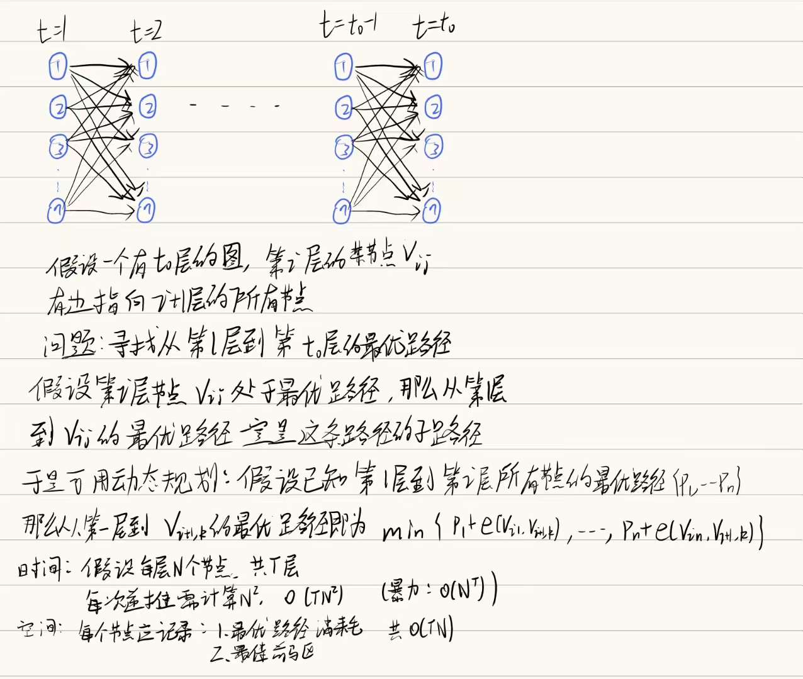
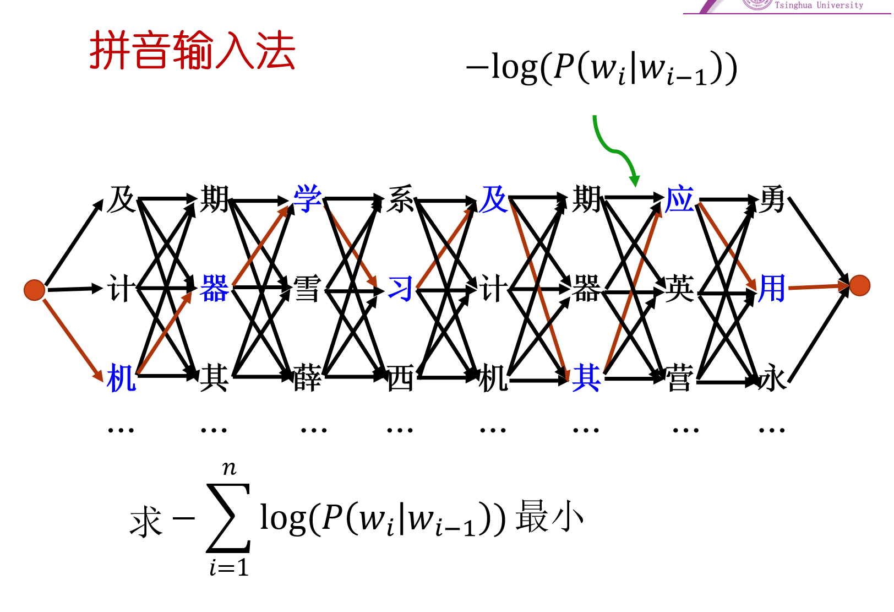

## 维特比算法

## 应用到拼音输入法
考虑简化二元语法模型：仅考虑上一个字的影响

那么拼音对应的汉字序列 
$$w_1,w2,…,wn$$
出现的概率就是：
$$P(w1​,w2​,…,wn​)≈P(w1​)∏_{i=2}^n​P(wi​∣wi−1​)$$
即：
$$w_1出现的概率\times w_1的基础上w_2出现的概率\times w_2基础上w_3出现的概率……………………$$

这里单个字符出现的概率可以基于单个字符的词频表给出，条件概率可以基于二元词频表给出

再取一个对数可以化为加法模型：

这就是之前的维特比算法的模型，边权就是条件概率的负对数


## 第二部分
### 要求
1. 基于二元模型实现拼音到汉字的转换程序（30分）
   1. 使用提供的汉字表建立起{拼音:[汉字列表]}的字典
   2. 使用语料库统计词频
    1. 首先对于语料进行清理，去除多余的符号
    2. 计算词频
    3. 存储词频表
   3. 使用维特比算法实现拼音到汉字的转换程序
   需要进行编码的转换，语料库是gbk编码
   首字符的处理

2. 其他提高性能的方法
   实现基于字的三元、四元模型
   实现基于词的模型
   针对已有模型进行优化（非调参！）
   对于未知效果方法的尝试
   分数根据性能和实现方法赋予

目录结构：
```
2023123456-张三/
├─ corpus/               用来存放语料
├─ data/
│  ├─ answer.txt         标准答案
│  ├─ input.txt          测试输入
│  ├─ output.txt         程序输出
│  ├─ 拼音汉字表.txt      拼音到候选汉字的对应表
│  └─ 一二级汉字表.txt    合法汉字范围
├─ src/
│  ├─ __init__.py
│  ├─ train.py     训练模块，会读取汉字表，遍历语料，统计频数
│  ├─ model.py     核心模型模块，会计算概率，运行viterbi算法
│  └─ eval.py      评测模块，用于测试并且统计准确率
├─ readme.md
├─ main.py         主程序
└─ requirements.txt
```
主程序起到调度的作用，会：
- 组织整个流程
- 读取 data/ 里的表和测试输入
- 从 corpus/sina_news_gbk/ 训练模型
- 调用 src/model.py 里的解码器做拼音转汉字
- 按要求输出结果
- 本地测试时还可以调用评测函数算字准确率、句准确率